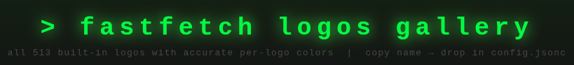
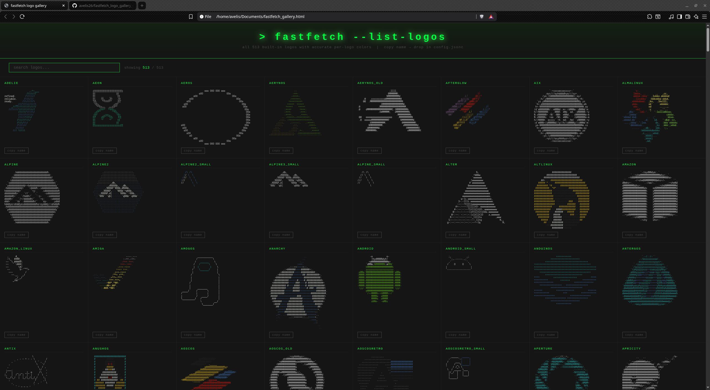
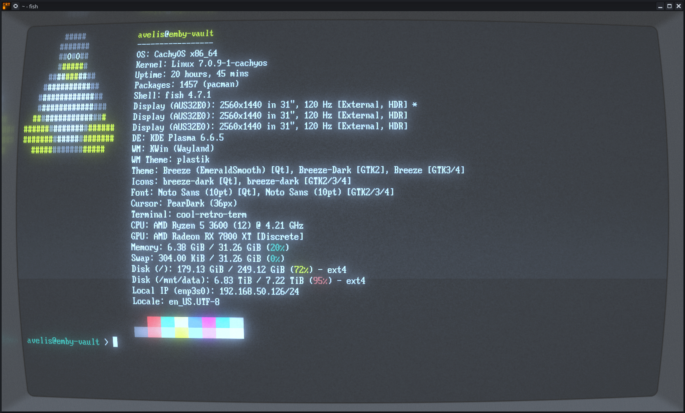
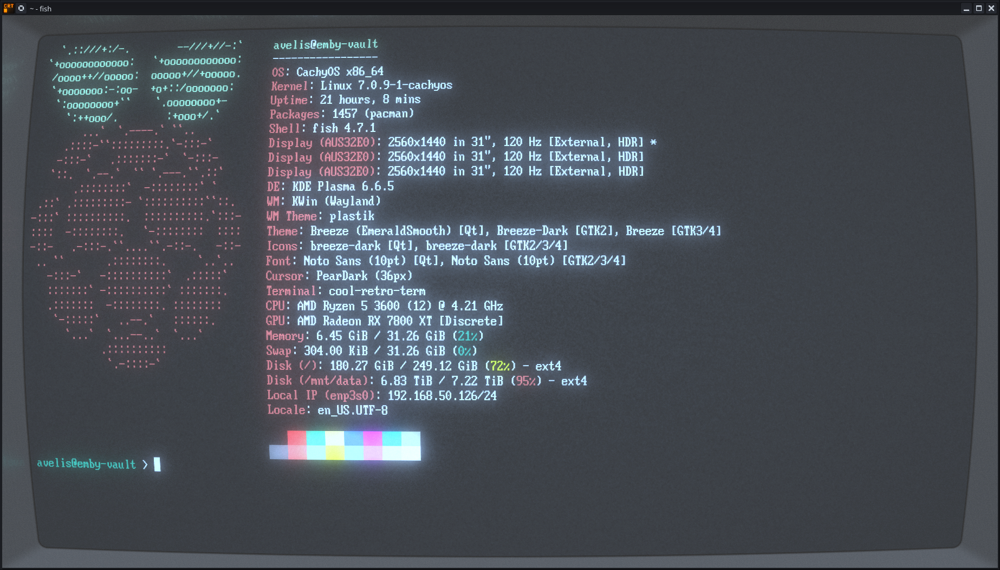

> A python script to fetch the fastfetch logo options and generate an HTML gallery for easy browsing.
> fastfetch is the tool that creates that fancy color ascii art termincal greeting and there are MANY
> options for switching the art logo to something else. So I decided to make a python tool so you can
> generate an HTML gallery to quickly and easily browse the logo options and select the name of the
> one you want.

## Use This Gallery To Find The Name Of The Logo:


## To Change This (Tux):


## To This (Rpi):


---

> [!TIP]
> The file to edit is `~/.config/fastfetch/config.jsonc` and the key to edit is `source`

```shell
avelis@emby-vault > pwd
/home/avelis/.config/fastfetch
avelis@emby-vault > cat config.jsonc | head -n 5
{
  "$schema": "https://github.com/fastfetch-cli/fastfetch/raw/master/doc/json_schema.json",
  "logo": {
    "source": "android"
  },
avelis@emby-vault >
```

## Project Structure

```shell
fastfetch_logo_gallery_generator/
├── main.py                             # Entry point
├── assets/
│   ├── Page_Screenshot.png             # Gallery Example
│   └── Terminal_Screenshot_Rpi.png     # Result Example 1
│   └── Terminal_Screenshot_Tux.png     # Result Example 2
├── README.md                           # Documentation
```
---
